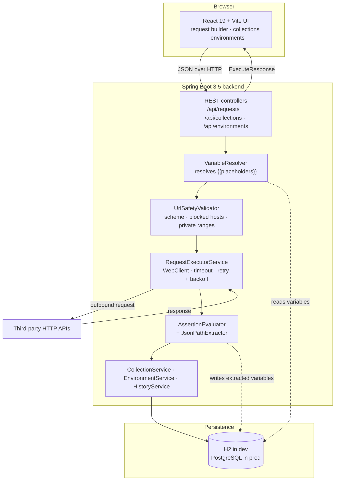
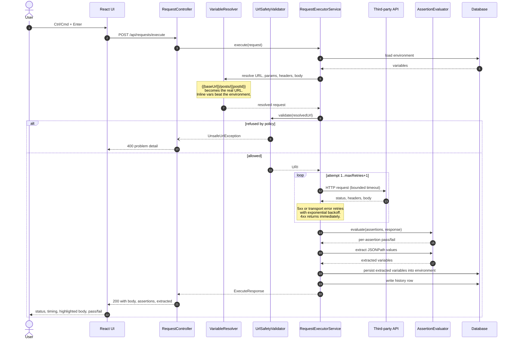
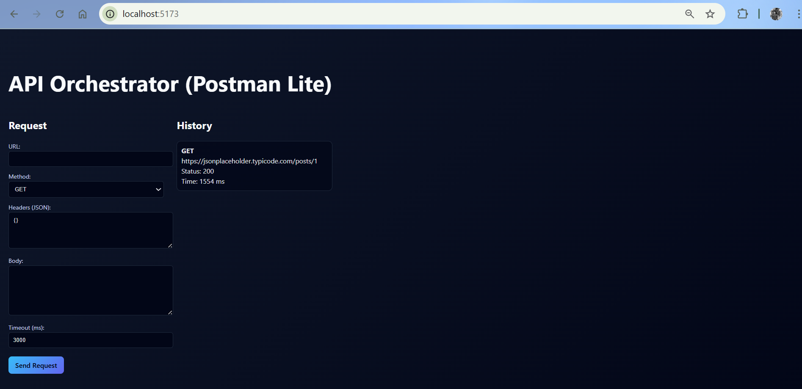

# API Orchestrator

[](../../actions/workflows/ci.yml)
[](https://openjdk.org/projects/jdk/17/)
[](https://spring.io/projects/spring-boot)
[](https://react.dev)
[](LICENSE)

A self-hosted HTTP request runner in the shape of a small Postman. You build a
request in the browser, the Spring Boot backend executes it against the real
third-party API, and the full exchange — status, headers, body, timing — comes
back and is persisted. On top of that plain execution it does the four things
that make a request runner actually useful day to day: requests are grouped into
**collections**, `{{variables}}` are resolved from a named **environment**, each
request can declare **assertions** that are evaluated against the response, and a
value can be **extracted** from one response into a variable so the next request
can use it. Postman v2.1 collections import and export, so it is not a dead end.

It is a portfolio project, not a Postman replacement: there is no authentication,
no multi-user support, no scripting, and no collection runner. What is documented
below exists and works.

---

## Table of contents

- [Features](#features)
- [Architecture](#architecture)
- [Request execution flow](#request-execution-flow)
- [Tech stack](#tech-stack)
- [Getting started](#getting-started)
- [API reference](#api-reference)
- [A worked example](#a-worked-example)
- [Configuration](#configuration)
- [Security: this tool fetches URLs you give it](#security-this-tool-fetches-urls-you-give-it)
- [Testing](#testing)
- [Project structure](#project-structure)
- [Screenshots](#screenshots)
- [Roadmap](#roadmap)
- [Contributing](#contributing)
- [License](#license)

---

## Features

### Execution engine

- Executes `GET`, `POST`, `PUT`, `PATCH`, `DELETE`, `HEAD` and `OPTIONS` with
  custom headers, query parameters and a raw body.
- Captures status, response headers, body, wall-clock time, byte size and the
  number of attempts.
- Per-request **timeout**, clamped by a server-side maximum.
- **Retry with exponential backoff**, applied to 5xx responses and transport
  failures only — a 4xx is a real answer and is never retried. When retries run
  out you get the last real response back, not a synthetic error.
- Response bodies are streamed with a byte ceiling and truncated rather than
  buffered without limit, so a huge response cannot exhaust memory.
- A transport failure is reported in its own `errorMessage` field with status
  `0`, never smuggled into the body.

### Collections and saved requests

- Named collections, each holding an ordered list of saved requests.
- A saved request stores its method, URL, headers, query parameters, body,
  assertions, extractions and retry/timeout settings.
- Full CRUD over both, from the API and from the UI sidebar.

### Environments and variable substitution

- Named environments holding key/value pairs.
- `{{variable}}` placeholders are resolved in the **URL, query parameters,
  header names and values, and the body** immediately before sending.
- Per-request inline variables override the environment's.
- Substitution is single-pass and an unknown placeholder is left verbatim, so a
  typo shows up in the resolved URL instead of silently producing a wrong
  request.

### Response assertions

Each request can declare expectations, evaluated after every run and reported
individually with the actual value:

| Type | `target` | `expected` |
| --- | --- | --- |
| `STATUS_EQUALS` | — | status code, e.g. `200` |
| `RESPONSE_TIME_UNDER` | — | milliseconds |
| `JSON_PATH_EQUALS` | JSONPath | exact value |
| `JSON_PATH_CONTAINS` | JSONPath | substring |
| `HEADER_PRESENT` | header name | — |
| `HEADER_EQUALS` | header name | exact value |
| `BODY_CONTAINS` | — | substring |

Header names are matched case-insensitively. A JSONPath that matches nothing, or
a body that is not JSON, fails the assertion rather than erroring.

### Request chaining

- An extraction spec pulls a value out of a response by JSONPath and binds it to
  a variable name.
- With `persist: true` the value is written into the active environment, so a
  later, entirely separate request resolves `{{name}}` to it.

### Postman interoperability

- Import a Postman v2.1 collection: headers, raw and urlencoded bodies, query
  parameters and nested folders (flattened into the request name).
- Collection-level `variable` entries become a new environment.
- Export back to v2.1 JSON. Assertions and extractions have no Postman
  equivalent, so they ride in a non-standard `_apiOrchestrator` key that Postman
  ignores and this application reads back — making an export/import cycle
  lossless.

### History

- Every execution is persisted with both the typed URL and the resolved one.
- The list endpoint is paged and omits response bodies; fetch one entry by id
  for the full captured response and assertion results.
- Clicking an entry in the UI replays it into the builder.

### Interface

- Collections tree and history in the sidebar; method selector, URL bar and
  tabbed editors for params, headers, body, assertions, extractions and
  settings; a response panel with status, timing, size, pretty-printed and
  syntax-highlighted JSON, headers, assertion results and extracted variables.
- Environment picker and variable editor.
- `Ctrl`/`Cmd` + `Enter` sends from anywhere.
- Dark and light themes, remembered, defaulting to the system preference.

### Operations

- OpenAPI 3 document and Swagger UI.
- H2 in memory for development, PostgreSQL via a `prod` profile.
- Docker images for both halves and a Compose stack.
- GitHub Actions CI for both halves.

---

## Architecture



## Request execution flow



---

## Tech stack

| Layer | Technology | Version |
| --- | --- | --- |
| Language | Java | 17 |
| Framework | Spring Boot | 3.5.11 |
| HTTP client | Spring WebClient over Reactor Netty | 1.2.15 |
| Persistence | Spring Data JPA / Hibernate | 6.6.42 |
| Database (dev) | H2 in-memory | 2.3.232 |
| Database (prod) | PostgreSQL driver | 42.7.10 |
| JSONPath | Jayway JsonPath | 2.9.0 |
| API docs | springdoc-openapi | 2.8.9 |
| Build | Maven Wrapper | 3.9.x |
| Testing | JUnit 5, AssertJ, MockMvc, OkHttp MockWebServer | 4.12.0 |
| UI | React | 19.2 |
| UI build | Vite | 7.3 |
| Linting | ESLint | 9.39 |
| Container | Docker multi-stage, nginx 1.27, PostgreSQL 16 | — |
| CI | GitHub Actions | — |

The UI has no runtime dependency beyond React: styling is plain CSS driven by
custom properties, and JSON highlighting is a small tokeniser.

---

## Getting started

### Prerequisites

- **JDK 17** (the Maven Wrapper is included, so no Maven installation needed)
- **Node.js 20+** and npm
- **Docker** and Docker Compose, only for the container path

### Clone

```bash
git clone https://github.com/vivekkumarq/api-orchestrator-platform.git
cd api-orchestrator-platform
```

### Option A — Docker Compose

Brings up PostgreSQL, the backend on the `prod` profile, and the UI behind
nginx.

```bash
cp .env.example .env      # optional; every value has a default
docker compose up --build
```

| Service | URL |
| --- | --- |
| UI | <http://localhost:5173> |
| API | <http://localhost:8080> |
| Swagger UI | <http://localhost:8080/swagger-ui.html> |

Stop with `docker compose down`, or `docker compose down -v` to drop the
database volume too.

> **Not verified.** The Dockerfiles and the Compose stack were written without
> Docker available, so they have never been built or run. Treat them as a
> starting point.

### Option B — run the two halves directly

**Backend** — from the `api-orchestrator` directory:

```bash
cd api-orchestrator
./mvnw spring-boot:run
```

It listens on <http://localhost:8080> with an in-memory H2 database that is
recreated on every start.

| Endpoint | URL |
| --- | --- |
| Swagger UI | <http://localhost:8080/swagger-ui.html> |
| OpenAPI JSON | <http://localhost:8080/v3/api-docs> |
| H2 console | <http://localhost:8080/h2-console> (JDBC URL `jdbc:h2:mem:orchestrator`, user `sa`, no password) |

**Frontend** — from the `api-orchestrator-ui` directory, in a second terminal:

```bash
cd api-orchestrator-ui
npm install
npm run dev
```

It serves <http://localhost:5173> and calls the backend at
`http://localhost:8080`. If your backend is elsewhere:

```bash
VITE_API_BASE_URL=http://localhost:9000 npm run dev
```

### Running against PostgreSQL without Docker

```bash
cd api-orchestrator
SPRING_PROFILES_ACTIVE=prod \
DB_URL=jdbc:postgresql://localhost:5432/orchestrator \
DB_USERNAME=orchestrator \
DB_PASSWORD=orchestrator \
./mvnw spring-boot:run
```

---

## API reference

Base URL `http://localhost:8080`. Everything lives under `/api`. Errors are
[RFC 7807](https://www.rfc-editor.org/rfc/rfc7807) problem documents.

### Requests

| Method | Path | Description |
| --- | --- | --- |
| `POST` | `/api/requests/execute` | Resolve variables, execute, assert, extract, record |
| `GET` | `/api/requests/history` | Paged history, newest first, without response bodies |
| `GET` | `/api/requests/history/{id}` | One history entry including the captured response |
| `DELETE` | `/api/requests/history` | Clear the history (`204`) |

`GET /api/requests/history` takes `page` (default `0`) and `size` (default `50`,
capped at `200`).

### Collections

| Method | Path | Description |
| --- | --- | --- |
| `GET` | `/api/collections` | All collections with their saved requests |
| `POST` | `/api/collections` | Create a collection (`201`) |
| `GET` | `/api/collections/{id}` | One collection |
| `PUT` | `/api/collections/{id}` | Rename or re-describe |
| `DELETE` | `/api/collections/{id}` | Delete it and every request in it (`204`) |
| `POST` | `/api/collections/{id}/requests` | Add a saved request (`201`) |
| `GET` | `/api/collections/{id}/requests/{requestId}` | One saved request |
| `PUT` | `/api/collections/{id}/requests/{requestId}` | Update a saved request |
| `DELETE` | `/api/collections/{id}/requests/{requestId}` | Remove it (`204`) |
| `POST` | `/api/collections/import` | Import Postman v2.1 JSON (`201`), optional `?name=` |
| `GET` | `/api/collections/{id}/export` | Export as Postman v2.1 JSON |

### Environments

| Method | Path | Description |
| --- | --- | --- |
| `GET` | `/api/environments` | All environments |
| `POST` | `/api/environments` | Create one (`201`) |
| `GET` | `/api/environments/{id}` | One environment |
| `PUT` | `/api/environments/{id}` | Replace its name and variable map |
| `PUT` | `/api/environments/{id}/variables/{key}` | Set a single variable |
| `DELETE` | `/api/environments/{id}` | Delete it (`204`) |

### `POST /api/requests/execute`

Request:

```json
{
  "method": "GET",
  "url": "{{baseUrl}}/posts/{{postId}}",
  "headers": { "Accept": "application/json" },
  "queryParams": { "verbose": "true" },
  "body": null,
  "timeoutMs": 5000,
  "maxRetries": 2,
  "retryBackoffMs": 200,
  "environmentId": "26e2fdd6-309d-4b9b-a592-74598be2ac36",
  "variables": { "postId": "1" },
  "assertions": [
    { "type": "STATUS_EQUALS", "expected": "200" },
    { "type": "JSON_PATH_EQUALS", "target": "$.id", "expected": "1" },
    { "type": "RESPONSE_TIME_UNDER", "expected": "2000" }
  ],
  "extractions": [
    { "name": "userId", "jsonPath": "$.userId", "persist": true }
  ]
}
```

Only `method` and `url` are required. `method` must be one of the seven verbs
listed above; anything else is a `400`, not a `500`.

Response:

```json
{
  "status": 200,
  "headers": { "Content-Type": "application/json; charset=utf-8" },
  "body": "{\n  \"userId\": 1,\n  \"id\": 1,\n  \"title\": \"...\"\n}",
  "responseTimeMs": 121,
  "resolvedUrl": "https://jsonplaceholder.typicode.com/posts/1",
  "responseSizeBytes": 292,
  "bodyTruncated": false,
  "attempts": 1,
  "errorMessage": null,
  "assertions": [
    {
      "type": "STATUS_EQUALS",
      "target": null,
      "expected": "200",
      "actual": "200",
      "passed": true,
      "message": "Status is 200"
    }
  ],
  "assertionsPassed": true,
  "extracted": { "userId": "1" },
  "historyId": "a0f1c4de-2f1e-4f6a-9a3d-2f0d1d0f9c31"
}
```

`status` is `0` when the exchange never completed; `errorMessage` says why.

### `POST /api/collections/{id}/requests`

```json
{
  "name": "Get post",
  "method": "GET",
  "url": "{{baseUrl}}/posts/{{postId}}",
  "headers": { "Accept": "application/json" },
  "queryParams": {},
  "body": null,
  "assertions": [{ "type": "STATUS_EQUALS", "expected": "200" }],
  "extractions": [{ "name": "userId", "jsonPath": "$.userId", "persist": true }],
  "timeoutMs": 5000,
  "maxRetries": 0,
  "retryBackoffMs": 200
}
```

### `POST /api/environments`

```json
{
  "name": "JSONPlaceholder",
  "variables": {
    "baseUrl": "https://jsonplaceholder.typicode.com",
    "postId": "1"
  }
}
```

### Error shape

```json
{
  "type": "about:blank",
  "title": "URL refused by outbound policy",
  "status": 400,
  "detail": "Host '169.254.169.254' is blocked by app.security.blocked-hosts"
}
```

---

## A worked example

Every command below runs against a freshly started backend and was executed
while writing this document.

**1. Create an environment.**

```bash
curl -s -X POST http://localhost:8080/api/environments \
  -H 'Content-Type: application/json' \
  -d '{"name":"JSONPlaceholder","variables":{"baseUrl":"https://jsonplaceholder.typicode.com","postId":"1"}}'
```

Note the `id` it returns; call it `$ENV_ID`.

**2. Create a collection.**

```bash
curl -s -X POST http://localhost:8080/api/collections \
  -H 'Content-Type: application/json' \
  -d '{"name":"JSONPlaceholder demo","description":"Sample requests"}'
```

Note its `id` as `$COL_ID`.

**3. Save a request that uses `{{baseUrl}}`, asserts, and extracts.**

```bash
curl -s -X POST http://localhost:8080/api/collections/$COL_ID/requests \
  -H 'Content-Type: application/json' \
  -d '{
        "name": "Get post",
        "method": "GET",
        "url": "{{baseUrl}}/posts/{{postId}}",
        "headers": {"Accept": "application/json"},
        "assertions": [
          {"type": "STATUS_EQUALS", "expected": "200"},
          {"type": "JSON_PATH_EQUALS", "target": "$.id", "expected": "1"}
        ],
        "extractions": [
          {"name": "userId", "jsonPath": "$.userId", "persist": true}
        ]
      }'
```

**4. Execute it against the environment.**

```bash
curl -s -X POST http://localhost:8080/api/requests/execute \
  -H 'Content-Type: application/json' \
  -d '{
        "method": "GET",
        "url": "{{baseUrl}}/posts/{{postId}}",
        "environmentId": "'"$ENV_ID"'",
        "headers": {"Accept": "application/json"},
        "assertions": [
          {"type": "STATUS_EQUALS", "expected": "200"},
          {"type": "JSON_PATH_EQUALS", "target": "$.id", "expected": "1"},
          {"type": "RESPONSE_TIME_UNDER", "expected": "5000"}
        ],
        "extractions": [
          {"name": "userId", "jsonPath": "$.userId", "persist": true}
        ]
      }'
```

`resolvedUrl` comes back as `https://jsonplaceholder.typicode.com/posts/1`,
`assertionsPassed` is `true`, and `extracted` is `{"userId": "1"}`.

**5. The extraction is now part of the environment — that is the chaining.**

```bash
curl -s http://localhost:8080/api/environments/$ENV_ID
```

```json
{
  "name": "JSONPlaceholder",
  "variables": {
    "baseUrl": "https://jsonplaceholder.typicode.com",
    "postId": "1",
    "userId": "1"
  }
}
```

**6. A second, independent request consumes it.**

```bash
curl -s -X POST http://localhost:8080/api/requests/execute \
  -H 'Content-Type: application/json' \
  -d '{
        "method": "GET",
        "url": "{{baseUrl}}/users/{{userId}}",
        "environmentId": "'"$ENV_ID"'",
        "assertions": [{"type": "JSON_PATH_EQUALS", "target": "$.id", "expected": "1"}]
      }'
```

`{{userId}}` resolves to the value the previous response produced, with nothing
copied by hand.

**7. Export the collection as a Postman file.**

```bash
curl -s http://localhost:8080/api/collections/$COL_ID/export \
  -o demo.postman_collection.json
```

---

## Configuration

Every setting is an environment variable with a working default; see
[`.env.example`](.env.example) for the same list in copy-paste form.

### Server and database

| Variable | Default | Purpose |
| --- | --- | --- |
| `SERVER_PORT` | `8080` | Port the backend listens on |
| `SPRING_PROFILES_ACTIVE` | *(none)* | Set to `prod` for PostgreSQL |
| `DB_URL` | `jdbc:h2:mem:orchestrator;DB_CLOSE_DELAY=-1` | JDBC URL (`jdbc:postgresql://localhost:5432/orchestrator` under `prod`) |
| `DB_USERNAME` | `sa` (`orchestrator` under `prod`) | Database user |
| `DB_PASSWORD` | *(empty)* (`orchestrator` under `prod`) | Database password |
| `H2_CONSOLE_ENABLED` | `true` | H2 web console; forced off under `prod` |
| `CORS_ALLOWED_ORIGINS` | `http://localhost:5173` | Comma-separated origins allowed to call `/api/**` |
| `LOG_LEVEL` | `INFO` | Log level for this application's packages |

### Execution engine

| Variable | Default | Purpose |
| --- | --- | --- |
| `EXECUTOR_DEFAULT_TIMEOUT_MS` | `10000` | Timeout when a request does not specify one |
| `EXECUTOR_MAX_TIMEOUT_MS` | `60000` | Ceiling on a requested timeout |
| `EXECUTOR_MAX_RESPONSE_BYTES` | `1048576` | Response bytes buffered before truncation |
| `EXECUTOR_MAX_PERSISTED_BODY_CHARS` | `20000` | Body characters kept in history |
| `EXECUTOR_MAX_RETRIES` | `5` | Ceiling on requested retries |

### Outbound safety

| Variable | Default | Purpose |
| --- | --- | --- |
| `ALLOW_PRIVATE_NETWORKS` | `true` (`false` under `prod`) | Whether loopback and private ranges may be reached |
| `ALLOWED_SCHEMES` | `http,https` | URI schemes the executor will dial |
| `BLOCKED_HOSTS` | `169.254.169.254,metadata.google.internal` | Always refused |

### Frontend

| Variable | Default | Purpose |
| --- | --- | --- |
| `VITE_API_BASE_URL` | `http://localhost:8080` | Backend base URL, inlined at **build** time |

---

## Security: this tool fetches URLs you give it

The whole point of this application is to make an HTTP request to a URL the
caller supplies, which makes it a server-side request forgery primitive by
construction. That is not a bug to be hidden; it is the feature. What matters is
that the policy is explicit and configurable:

- Only the schemes in `ALLOWED_SCHEMES` are dialled — `file://`, `gopher://` and
  the rest are refused.
- Hosts in `BLOCKED_HOSTS` are always refused. Cloud metadata endpoints are on
  that list by default, because they are the classic SSRF target.
- When `ALLOW_PRIVATE_NETWORKS` is `false`, any host resolving to a loopback,
  link-local, site-local, any-local or multicast address is refused.

`ALLOW_PRIVATE_NETWORKS` defaults to `true` in the development profile, because
the common local use of this tool is poking at a service on `localhost`. **The
`prod` profile turns it off.** If you deploy this anywhere that someone you do
not trust can reach it, leave it off: with it on, whoever can call
`/api/requests/execute` can reach anything the process can reach — your
database, your internal services, your cloud metadata endpoint.

Two limitations stated plainly:

- The check resolves DNS once and the HTTP client resolves it again, so a name
  that flips between a public and a private address in between (DNS rebinding)
  can slip past. Closing that needs a connection-level check inside the client.
- There is no authentication on the API at all. Anyone who can reach it can use
  it. Do not expose it to the internet.

---

## Testing

```bash
cd api-orchestrator
./mvnw -B clean verify
```

71 tests, all passing. The execution engine is tested over a real socket with
OkHttp's MockWebServer rather than against a mocked client, because that is the
part of this application worth being sure about:

| Suite | Covers |
| --- | --- |
| `RequestExecutorServiceTest` | Success, non-2xx, timeout, retry to eventual success, retry exhaustion, no retry on 4xx, variable substitution, inline overrides, extraction and chaining, assertions, connection failure, SSRF refusal |
| `RequestExecutorTruncationTest` | Both body ceilings, with tiny configured limits |
| `VariableResolverTest` | Substitution, unknown placeholders, single-pass behaviour, literal `$`, merge precedence |
| `AssertionEvaluatorTest` | All seven assertion types, missing paths, non-JSON bodies |
| `UrlSafetyValidatorTest` | Scheme allowlist, malformed URLs, blocked hosts, private ranges |
| `PostmanCollectionServiceTest` | Importing the repository's own sample file, a richer one with folders and disabled entries, and an export/import round trip |
| `CollectionControllerTest`, `EnvironmentControllerTest`, `RequestControllerTest` | The HTTP surface through MockMvc, including validation and error mapping |

Frontend:

```bash
cd api-orchestrator-ui
npm run lint
npm run build
```

---

## Project structure

```
api-orchestrator-platform/
├── api-orchestrator/                  Spring Boot backend
│   ├── src/main/java/com/vivek/platform/apiorchestrator/
│   │   ├── ApiOrchestratorApplication.java
│   │   ├── api/                       REST controllers, DTOs, error handling
│   │   │   ├── RequestController.java
│   │   │   ├── CollectionController.java
│   │   │   ├── EnvironmentController.java
│   │   │   ├── GlobalExceptionHandler.java
│   │   │   └── dto/
│   │   ├── config/                    Properties, WebClient, CORS, OpenAPI
│   │   ├── domain/                    JPA entities
│   │   ├── exception/
│   │   ├── repository/
│   │   └── service/
│   │       ├── RequestExecutorService.java   The execution engine
│   │       ├── VariableResolver.java
│   │       ├── UrlSafetyValidator.java
│   │       ├── AssertionEvaluator.java
│   │       ├── JsonPathExtractor.java
│   │       ├── CollectionService.java
│   │       ├── EnvironmentService.java
│   │       ├── HistoryService.java
│   │       └── PostmanCollectionService.java
│   ├── src/main/resources/application.yaml
│   ├── src/test/                      JUnit 5 suites and Postman fixtures
│   ├── Dockerfile
│   └── pom.xml
├── api-orchestrator-ui/               React + Vite frontend
│   ├── src/
│   │   ├── App.jsx
│   │   ├── components/
│   │   ├── lib/
│   │   └── styles/
│   ├── Dockerfile
│   ├── nginx.conf
│   └── package.json
├── docs/screenshots/
├── .github/workflows/ci.yml
├── api-orchestrator.postman_collection.json
├── docker-compose.yml
├── .env.example
├── CONTRIBUTING.md
├── LICENSE
└── README.md
```

---

## Screenshots



Further screenshots belong in [`docs/screenshots/`](docs/screenshots/); see the
[capture list](docs/screenshots/README.md) for the views worth including. The
image above is the only one captured so far.

---

## Roadmap

Not built, in rough order of usefulness:

- [ ] Collection runner: execute every request in a collection in order and
      report a pass/fail summary
- [ ] Authentication helpers (bearer token, basic, OAuth 2 client credentials)
- [ ] Folders inside collections, instead of flattening Postman's on import
- [ ] Import and export of Postman *environment* files, not just collections
- [ ] Response diffing between two runs of the same request
- [ ] Cookie jar shared across a chain of requests
- [ ] Multi-user support with per-user workspaces
- [ ] Connection-level SSRF check to close the DNS rebinding gap

---

## Contributing

See [CONTRIBUTING.md](CONTRIBUTING.md).

## License

[MIT](LICENSE) © 2026 Vivek Kumar
